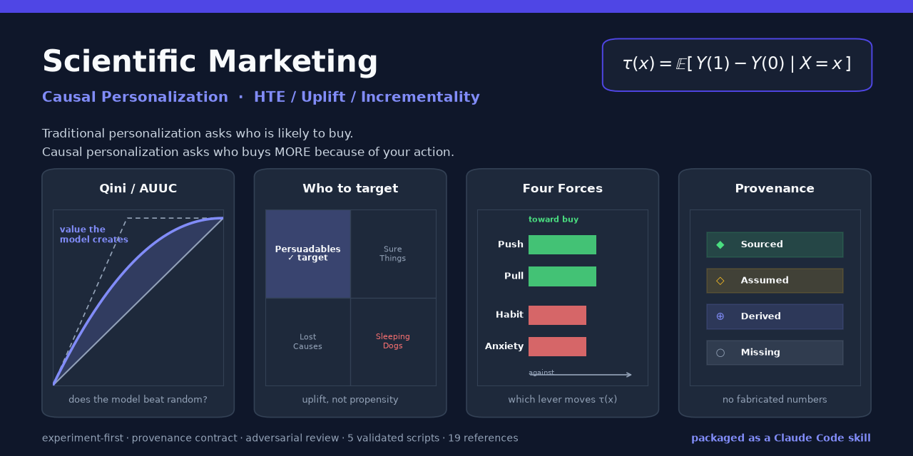
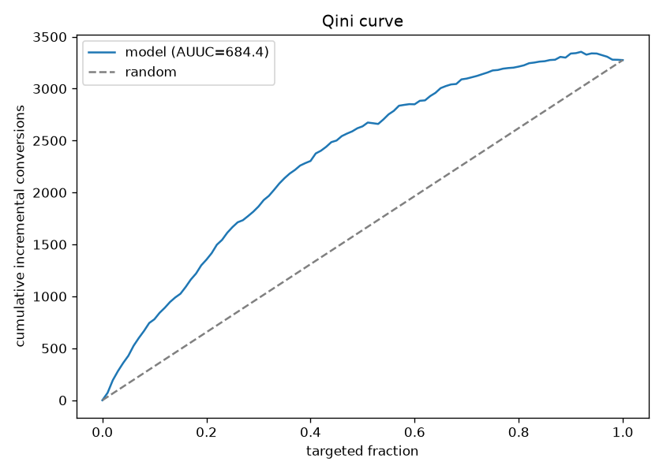

<div align="center">



# Scientific Marketing · Causal Personalization

### HTE / Uplift / Incrementality — packaged as a Claude Code skill

[](https://claude.ai/code)
[](#-dependencies--examples)
[](#-reference-library)
[](https://github.com/alexwang91/scientific-marketing-personalized-attribution-hte/actions/workflows/validate.yml)
[](#-scripts)
[](#-methodology-stance)
[](LICENSE)

**Traditional personalization asks who is likely to buy. Causal personalization asks who bought *more* because of your action.**

τ(x) = E[Y(1) − Y(0) | X = x]

[Quickstart](#-quickstart) · [What it does](#-what-it-does) · [How it works](#-how-it-works) · [References](#-reference-library) · [Methodology](#-methodology-stance)

</div>

---

## ✨ What it does

A knowledge base that turns marketing causal inference into an **executable decision process**, packaged as a Claude Code agent skill. Not a model — a system:

- **AI generates** — treatment variants, context extracted from unstructured data (reviews / support logs / sales calls), experiment docs, model explanations, drift monitoring.
- **Causal methods judge** — whether actions have *incremental* value (τ(x)), not correlation.
- **Institutional rules keep it honest** — experiment-first, a number provenance contract, adversarial review, compliance red lines.

---

## 🖼 Proof

The scripts run. The chart below is real output from `scripts/qini_auuc.py`, not a mockup:

<div align="center">



*Qini curve: x-axis = share of population reached (sorted by predicted uplift), y-axis = cumulative incremental lift. The area between the model curve and the random line is the value the model creates.*

</div>

---

## 🚀 Quickstart

```bash
git clone https://github.com/alexwang91/scientific-marketing-personalized-attribution-hte.git
cd scientific-marketing-personalized-attribution-hte
```

Claude Code auto-loads skills in `.claude/skills/`. Ask anything about **marketing lift, uplift modeling, discount strategy, experiment design, attribution vs incrementality, lead routing** — or plain-language versions like "should I give this customer a coupon", "is my ad actually working", "who should I target and who should I skip".

**Generate a decision report:**

```bash
cd .claude/skills/sm-causal-personalization/scripts
python generate_report.py --config ../examples/sample-sku-en-config.json --output report.html
python generate_report.py --config ../examples/sample-sku-en-config.json --validate-only   # provenance contract check only
python generate_report.py --config ../examples/sample-sku-en-config.json --depth quick      # executive view: verdict + math + gate + evidence
python generate_report.py --config ../examples/sample-sku-en-config.json --depth deep       # full report + validation roadmap (§18)
python generate_report.py --config ../examples/aurora-airpurifier-category-config.json      # category portfolio diagnostic (ref 17)
python generate_report.py --demo > demo.html                                              # minimal schema demo
python generate_report.py --config c.json --embed-echarts echarts.min.js --output r.html  # offline HTML (no CDN)
```

Three depth modes (`--depth`): `quick` renders decision-critical sections only; `standard` (default) renders the full report; `deep` appends a **validation roadmap** (§18) — all open challenges, missing inputs, and test predictions consolidated into one list ranked by what would change the decision. Builds only from existing config data, invents nothing.

**Run the core scripts:**

```bash
python power_analysis.py    # uplift experiment power: sample size to detect incremental difference (~4× a standard A/B)
python qini_auuc.py         # Qini / AUUC + bootstrap CI + decile calibration
python ope_estimators.py    # IPS / SNIPS / Doubly-Robust off-policy evaluation + support check
python hte_starter.py       # T / X / DR-learner starter templates (sklearn, swappable with EconML / CausalML)
python policy_budget.py     # λ* budget-constrained allocation + IPW policy value + profit-vs-budget curve
```

Or install everything as a package (`smcp`) with a `sm-report` CLI:

```bash
pip install .               # from the repo root
python -c "from smcp.policy_budget import allocate"
sm-report --demo > demo.html
```

---

## 🏗️ How it works

**Four-layer production architecture:**

```
Layer 1 · Data & Experiment Assets    RCT logs + propensity P(t|x) + GCG + historical experiments
                                       (each experiment is a reusable evaluation asset)
Layer 2 · Effect Estimation           τ̂(x) via DR-learner / Causal Forest / X-learner
                                       (calibrated AND ranked; ZILN loss for revenue Y)
Layer 3 · Decision & Allocation       Policy π(x): argmax + λ* budget constraint + OPE gate
                                       (large action space: MIPS / OffCEM)
Layer 4 · Generation & Serving        LLM embeddings as features (not in the decision loop);
          (optional)                   GenAI serving layer for copy personalization
```

**Maturity ladder — do not skip levels:**

| Level | Content | Most teams |
|-------|---------|-----------|
| **L1** | Global Control Group (GCG) + retrospective uplift analysis | Starting point for everyone |
| **L2** | Offline policy learning + OPE validation + periodic retraining | **Stay here for a long time** |
| **L3** | Contextual bandit with online learning | Only when actions are numerous and the environment changes fast |

**Product × country pipeline** (ref 13): Stage 0 local market intelligence → evidence → unit economics → channel screen (may terminate here) → dimensions → review → tests → render report.

---

## 📚 Reference library

Each reference follows a fixed template: **when to use → decision tree → minimum necessary math → step-by-step → common failure modes → acceptance checklist → literature**. Decision guide, not textbook.

<details>
<summary><b>Expand all 19 references</b></summary>

**Research & framing**
| Ref | Topic |
|-----|-------|
| `00` local-market-intelligence | Dynamic market scan: 7-axis positioning → transfer-assumption ledger → distinctiveness hypotheses → ranking → re-orchestration |
| `00b` customer-voice-competitor-scan | Engagement-ranked mining of real reviews / competitors, populating Push / Pull / Habit / Anxiety and candidate dimensions (voice = Hypothesis-grade: generates what to test, never proves incrementality) |
| `01` problem-framing | Profit metric; attribution × incrementality × MMM triangle; WTP → discount window (τ(discount) only lives between discounted price and WTP) |

**Core causal chain**
| Ref | Topic |
|-----|-------|
| `02` treatment-design | Action library, treatment card, four-force mechanism, LLM variant explosion, archetype-first creator/KOL scoring |
| `03` experiments | Identification ladder, GCG infrastructure, HTE power, propensity log, assumption → validation ledger |
| `04` hte-estimation | Learner selection default path; Qini/AUUC validation trio |
| `05` uplift-segmentation | Four-quadrant (communication tool), Ascarza lesson, sleeping dogs |
| `06` policy-nbt | Policy value, budget constraint λ*, OPE launch process |
| `07` bandits-online | L3 admission four questions, Thompson Sampling, drift and feedback loops |
| `08` long-term-value | Surrogate index, pull-forward, long-term holdout |

**Governance & rollout**
| Ref | Topic |
|-----|-------|
| `09` governance | Feature four questions, red-team checklist, anti-persona, AI role red lines (run at kickoff) |
| `10` org-playbook | Marketing side + sales side (lead routing / discount / ABM) rollout |
| `11` production-architecture | Data engineering, retraining, serving, CPOG-style architecture |

**Output & delivery**
| Ref | Topic |
|-----|-------|
| `12` html-report-output | Five-question chapter spine (The Call / The Money / The Play / Execution / The Receipts), 6-element decision memo, provenance rendering |
| `13` product-country-pipeline | 8-stage product × country pipeline |
| `14` d-dimension-reviewer | D-dimension generation gate + independent adversarial review; open-blocking → BLOCKED budget linkage |
| `15` writing-rules | Language policy, falsifiability obligation, honest-state vocabulary, anti-slop, narrative and theory-usability principles |
| `16` estimation-discipline | Four provenance states, Fermi chains, benchmark asymmetry, sensitivity-sorted Missing ledger |
| `17` category-portfolio-diagnostic | Whole-category line-up audit upstream of the SKU pipeline: 6 audit lenses (2 market + 4 audited-P), severity capped by evidence grade, SKU verdicts (Grow / Hold / Harvest / Exit), 4P matrix; feeds confirmed Grow SKUs into ref 13 → 04 |

</details>

---

## 🔧 Scripts

Re-validated by CI on every push ([`.github/workflows/validate.yml`](.github/workflows/validate.yml)): the workflow runs all five core scripts end-to-end, validates every example config against the provenance contract, renders each to HTML, runs the unit-test suite, and smoke-tests the pip package. Each script maps to a gating step in the report.

| Script | Purpose | Report bridge |
|--------|---------|--------------|
| `power_analysis.py` | Uplift experiment power: sample size to detect incremental difference (~4× a standard A/B) | §9 gate + §13 duration |
| `qini_auuc.py` | Qini curve, AUUC + bootstrap CI, decile calibration, two-model comparison | §11 AUUC launch gate |
| `ope_estimators.py` | IPS / SNIPS / DR off-policy evaluation + support check | §14 OPE support check |
| `hte_starter.py` | T / X / DR-learner starter templates (sklearn, drop-in replaceable with EconML / CausalML) | — |
| `policy_budget.py` | λ* budget-constrained allocation (ref 06 knapsack / shadow price), IPW policy value on a randomized holdout, profit-vs-budget curve | Layer 3 decision tool |
| `generate_report.py` | Decision-memo HTML generator (v2). **Enforces the provenance contract**: build fails on any number not tagged sourced / assumed / derived / missing. **v3: organized as five reader questions** (spend or not? / the math / the play / execution / the receipts) with bilingual operator language built in (`meta.lang`), unified task cards (owner / due / stop-loss), 5 interactive causal-logic charts (ECharts), `--format dashboard` interactive cockpit, three depth modes `--depth quick / standard / deep` | **HTML output entry point** |

---

## 🧭 Methodology stance

Hard constraints, written into the rules and enforced by the tooling:

1. **Experiment-first is a hard rule** — without randomized data, build GCG / geo infrastructure first. Do not estimate CATE from observational logs.
2. **Honest blanks beat fabricated completeness** — every number is sourced, assumed (basis stated), derived (chain shown), or missing (placeholder). There is no fifth state. `generate_report.py` enforces this at build time.
3. **Estimators follow a narrow default path** — no surveys; validation accepts only Qini/AUUC + decile calibration.
4. **The four-quadrant is a communication tool** — live decisions use continuous τ̂ − cost + budget constraint.
5. **Maturity ladder L1→L2→L3, no skipping** — most teams should stay at L2 indefinitely.
6. **AI has a hard role boundary** — it cannot declare an action effective without experimental support. LLM evaluation (including multi-agent simulation) does not replace a holdout.
7. **Customer voice is Hypothesis-grade** — reviews and sentiment generate what to test, never prove incrementality (ref 00b).

---

## 📦 Dependencies & Examples

```bash
pip install numpy pandas scipy scikit-learn matplotlib
```

For production, swap in [EconML](https://github.com/py-why/EconML) / [CausalML](https://github.com/uber/causalml).

**Example configs** (`.claude/skills/sm-causal-personalization/examples/`):

- `sample-sku-en-config.json` — English, standard single-SKU report (fictional brand / product)
- `sample-sku-zh-config.json` — Chinese version with full UI label overrides, TL;DR page, and ECharts localization (fictional brand / product)
- `aurora-airpurifier-category-config.json` — category portfolio diagnostic (ref 17), fictional brand / SKUs: `report_type=category_portfolio`

Pre-rendered HTML of each config lives in [`examples/rendered/`](.claude/skills/sm-causal-personalization/examples/rendered) — open them to preview the deliverable without running anything.

**中文说明 / Chinese README** → [`README.zh.md`](README.zh.md)

---

## 📄 License

[Apache License 2.0](LICENSE) © 2026 alexwang91.
*Free to use, modify, and distribute with attribution and the included patent grant.*
